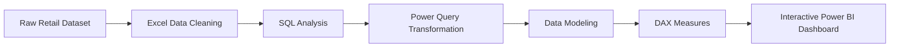

# 🛒 Blinkit Retail Analytics Dashboard


---

# 📌 Project Overview

The **Blinkit Retail Analytics Dashboard** is an end-to-end Business Intelligence project developed using **Excel, SQL, and Power BI**.

The objective of this project is to transform raw retail transaction data into meaningful business insights through data cleaning, SQL analysis, data modeling, and interactive dashboards.

The dashboard enables business stakeholders to monitor sales performance, customer purchasing behavior, delivery performance, payment preferences, and product category trends for better business decision-making.

---

# 🎯 Business Objectives

- Analyze total revenue and sales performance
- Monitor monthly sales trends
- Identify top-performing brands
- Analyze revenue contribution by category
- Evaluate delivery performance
- Study customer payment preferences
- Track business KPIs
- Support data-driven business decisions

---

# 🛠️ Tech Stack

| Tool | Purpose |
|------|----------|
| Microsoft Excel | Data Cleaning & Preparation |
| SQL | Data Extraction & Analysis |
| Power BI | Dashboard Development |
| Power Query | Data Transformation |
| DAX | KPI Measures & Calculations |

---

# 📂 Dataset Information

The project contains retail sales data including:

- Customer Orders
- Products
- Order Items
- Brands
- Categories
- Payment Methods
- Delivery Status
- Sales Amount
- Quantity Sold
- Order Date

---

# 📊 Dashboard Preview


---

# 📈 Key Performance Indicators

- 💰 Total Sales : ₹4.97M
- 📦 Total Quantity Sold : 10K
- 🛒 Total Orders : 5K
- 👥 Total Customers : 2K
- 💵 Average Order Value (AOV) : ₹994.48
- 🚚 On-Time Delivery Rate : 69.4%

---

# 📊 Dashboard Features

### Executive KPI Cards

- Total Sales
- Total Quantity
- Total Orders
- Total Customers
- Average Order Value
- On-Time Delivery %

### Business Visualizations

- Monthly Sales Trend
- Revenue by Category
- Top Performing Brands
- Payment Method Distribution
- Delivery Performance Analysis
- Business Insights Panel

### Interactive Filters

- Year
- Month
- Category
- Brand
- Payment Method

---

# 📋 SQL Concepts Used

- SELECT
- WHERE
- GROUP BY
- ORDER BY
- HAVING
- Aggregate Functions
- CASE Statements
- Joins
- Common Table Expressions (CTEs)
- Window Functions
- Subqueries

---

# 📊 Power BI Concepts Used

- Data Modeling
- Power Query
- Relationships
- DAX Measures
- KPI Cards
- Line Charts
- Bar Charts
- Donut Charts
- Slicers
- Interactive Dashboard Design

---

# 💡 Business Insights

- 📈 Sales reached their highest value during **August**, indicating strong seasonal demand.
- 🥛 **Dairy & Breakfast** generated the highest overall revenue.
- 🏆 **Karnik PLC** emerged as the top-performing brand.
- 💳 Card payments were the most preferred payment method.
- 🚚 **69.4%** of all customer orders were delivered on time.
- 📊 Revenue remained consistently strong between **August and October**.

---

# 📁 Project Structure

```
Blinkit-Retail-Analytics-Dashboard
│
├── Data
│   └── Blinkit_Retail_Analytics.xlsx
│
├── SQL
│   └── Blinkit_Project.sql
│
├── PowerBI
│   └── Blinkit_Dashboard.pbix
│
├── Images
│   └── Dashboard.png
│
├── README.md
└── LICENSE
```

---

# 🔄 Project Workflow



---

# 📚 Skills Demonstrated

- Data Cleaning
- SQL Query Writing
- Data Transformation
- Business Intelligence
- Data Modeling
- Dashboard Development
- KPI Design
- Data Visualization
- Business Insight Generation

---

# 🚀 Future Enhancements

- Sales Forecasting
- Customer Segmentation
- Profitability Analysis
- Inventory Optimization
- Predictive Analytics using Python
- Automated Data Refresh

---

# 👨‍💻 Author

**Bibhuti Bhusana Patnaik**

Aspiring Data Analyst | Business Intelligence Enthusiast

### Technical Skills

- Microsoft Excel
- SQL
- Power BI
- DAX
- Power Query
- Python (Basic)

---

⭐ If you found this project useful, feel free to star the repository.
