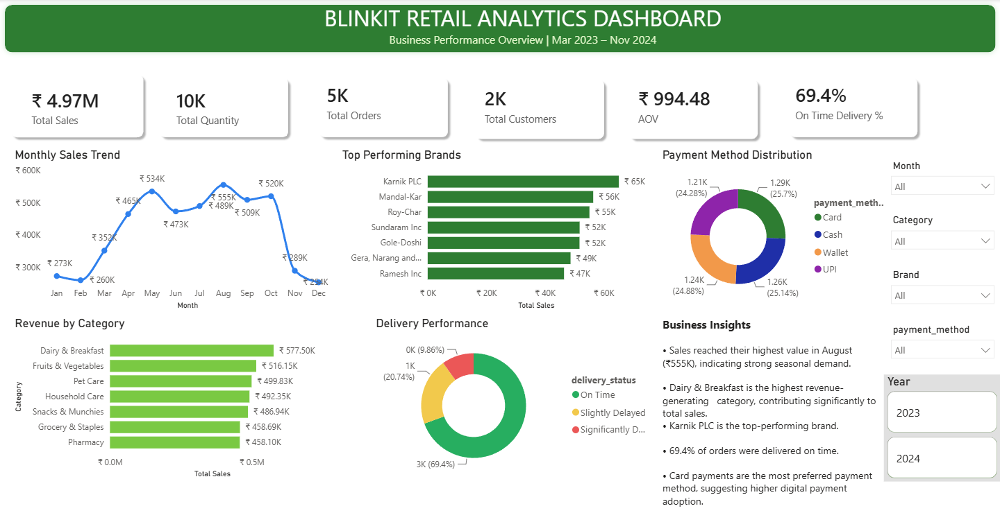
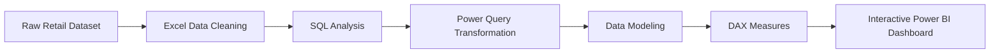

# 🛒 Blinkit Retail Analytics Dashboard

<p align="center">

</p>


---

## 📑 Table of Contents

- Project Overview
- Business Objectives
- Tech Stack
- Dataset
- Business Impact
- Project Highlights
- KPIs
- Dashboard Features
- SQL Concepts
- Power BI Concepts
- Business Insights
- Project Workflow
- Skills Demonstrated
- Future Enhancements
- About the Author

---

# 📌 Project Overview

The **Blinkit Retail Analytics Dashboard** is an end-to-end Business Intelligence project developed using **Excel, SQL, and Power BI**.

The objective of this project is to transform raw retail transaction data into meaningful business insights through data cleaning, SQL analysis, data modeling, and interactive dashboards.

The dashboard enables business stakeholders to monitor sales performance, customer purchasing behavior, delivery performance, payment preferences, and product category trends for better business decision-making.

---

# 🎯 Business Objectives

- Analyze total revenue and sales performance
- Monitor monthly sales trends
- Identify top-performing brands
- Analyze revenue contribution by category
- Evaluate delivery performance
- Study customer payment preferences
- Track business KPIs
- Support data-driven business decisions

---

# 🛠️ Tech Stack

| Tool | Purpose |
|------|----------|
| Microsoft Excel | Data Cleaning & Preparation |
| SQL | Data Extraction & Analysis |
| Power BI | Dashboard Development |
| Power Query | Data Transformation |
| DAX | KPI Measures & Calculations |

---

# 📂 Dataset Information

The project contains retail sales data including:

- Customer Orders
- Products
- Order Items
- Brands
- Categories
- Payment Methods
- Delivery Status
- Sales Amount
- Quantity Sold
- Order Date

---

## 📈 Business Impact

The dashboard enables business users to:

- Monitor sales performance in real time
- Identify high-performing categories
- Improve delivery efficiency
- Understand customer purchasing behavior
- Optimize product strategy
- Support data-driven decision making

---

# 🚀 Project Highlights

- Built an end-to-end retail analytics dashboard using **Excel, SQL, Power Query, and Power BI**.
- Cleaned, transformed, and modeled retail sales data to create a structured Business Intelligence solution.
- Developed **6 DAX KPI measures** to monitor Total Sales, Total Quantity, Total Orders, Total Customers, Average Order Value (AOV), and On-Time Delivery Rate.
- Designed **5 interactive business visualizations** to analyze monthly sales trends, product categories, top-performing brands, payment methods, and delivery    performance.
- Implemented **dynamic slicers and cross-filtering** for Year, Month, Category, Brand, and Payment Method to enable interactive data exploration.
- Generated actionable business insights to support sales monitoring, customer behavior analysis, and strategic decision-making.
---

# 📈 Key Performance Indicators

- 💰 Total Sales : ₹4.97M
- 📦 Total Quantity Sold : 10K
- 🛒 Total Orders : 5K
- 👥 Total Customers : 2K
- 💵 Average Order Value (AOV) : ₹994.48
- 🚚 On-Time Delivery Rate : 69.4%

---

# 📊 Dashboard Features

### Executive KPI Cards

- Total Sales
- Total Quantity
- Total Orders
- Total Customers
- Average Order Value
- On-Time Delivery %

### Business Visualizations

- Monthly Sales Trend
- Revenue by Category
- Top Performing Brands
- Payment Method Distribution
- Delivery Performance Analysis
- Business Insights Panel

### Interactive Filters

- Year
- Month
- Category
- Brand
- Payment Method

---

# 📋 SQL Concepts Used

- SELECT
- WHERE
- GROUP BY
- ORDER BY
- HAVING
- Aggregate Functions
- CASE Statements
- Joins
- Common Table Expressions (CTEs)
- Window Functions
- Subqueries

---

# 📊 Power BI Concepts Used

- Data Modeling
- Power Query
- Relationships
- DAX Measures
- KPI Cards
- Line Charts
- Bar Charts
- Donut Charts
- Slicers
- Interactive Dashboard Design

---

# 💡 Business Insights

- 📈 Sales reached their highest value during **August**, indicating strong seasonal demand.
- 🥛 **Dairy & Breakfast** generated the highest overall revenue.
- 🏆 **Karnik PLC** emerged as the top-performing brand.
- 💳 Card payments were the most preferred payment method.
- 🚚 **69.4%** of all customer orders were delivered on time.
- 📊 Revenue remained consistently strong between **August and October**.

---

# 📁 Project Structure

```
Blinkit-Retail-Analytics-Dashboard
│
├── Data
│   └── Blinkit_Retail_Analytics.xlsx
│
├── SQL
│   └── Blinkit_Project.sql
│
├── PowerBI
│   └── Blinkit_Dashboard.pbix
│
├── Images
│   └── Dashboard.png
│
├── README.md
└── LICENSE
```

---

# 🚀 Getting Started

## Prerequisites

- Power BI Desktop
- Microsoft Excel
- SQL Server / MySQL (optional, for running SQL queries)

## Installation & Usage

1. Clone this repository:
   ```bash
   git clone https://github.com/Bibhuti123456/Blinkit-Retail-Analytics-Dashboard.git
2. Open the PowerBI/Blinkit_Dashboard.pbix file using Power BI Desktop.
3. If required, update the data source paths and click Refresh.
4. Use the interactive slicers to explore sales, customer, product, and delivery insights.

---

# 🔄 Project Workflow



---

# 📚 Skills Demonstrated

- Data Cleaning
- SQL Query Writing
- Data Transformation
- Business Intelligence
- Data Modeling
- Dashboard Development
- KPI Design
- Data Visualization
- Business Insight Generation

---

# 🚀 Future Enhancements

• Sales Forecasting using Prophet
• Customer Lifetime Value Prediction
• RFM Analysis
• Inventory Demand Forecasting
• AI-based Product Recommendation

---

## Key Learnings

• Building a star schema
• Writing optimized SQL queries
• Creating reusable DAX measures
• Designing executive dashboards
• Translating business questions into KPIs

---

### Technical Skills

- Microsoft Excel
- SQL
- Power BI
- DAX
- Power Query
- Python (Basic)

---

## 👨‍💻 About the Author

**Bibhuti Bhusana Patnaik**

Data Analyst | Power BI | SQL | Excel | Python | Business Intelligence

Passionate about transforming raw data into actionable business insights through analytics, dashboard development, and visualization.

📧 Email: [bibhutipatnaik](bibhutipatnaik123@gmail.com)

🔗 GitHub: [Bibhuti123456](https://github.com/Bibhuti123456)

💼 LinkedIn: [Bibhuti Bhusana Patnaik](https://www.linkedin.com/in/bibhuti-bhusana-patnaik/)

---

⭐ If you found this project useful, feel free to star the repository.
